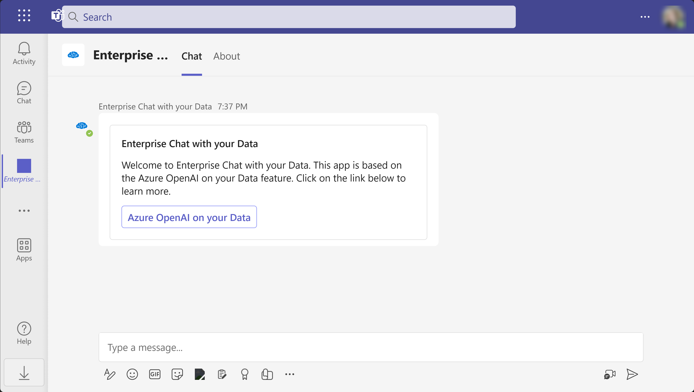
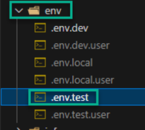
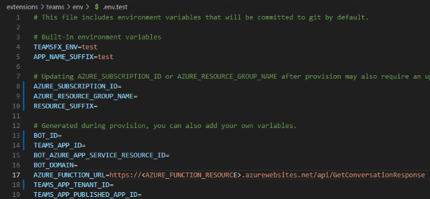
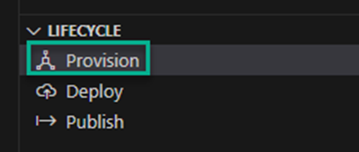
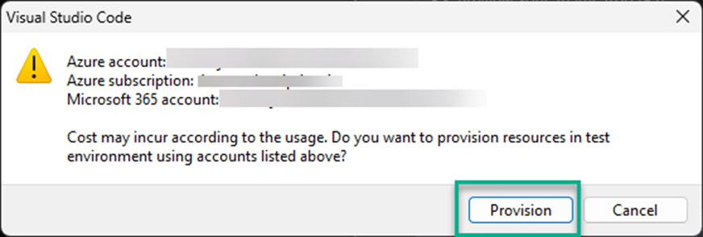
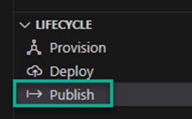
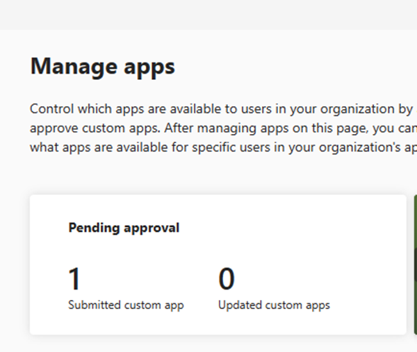
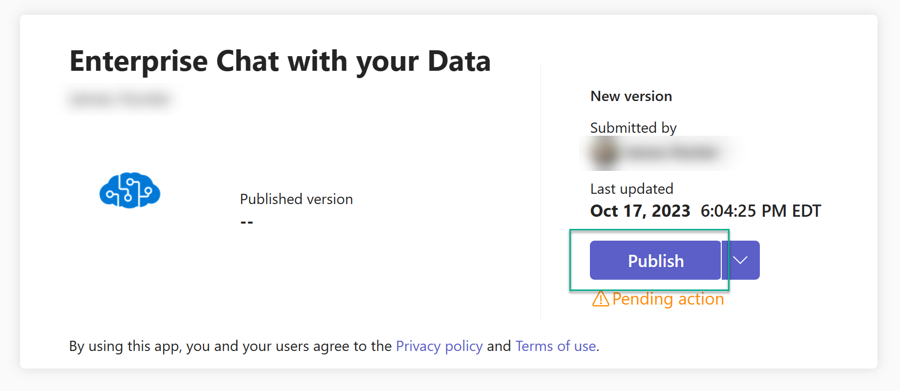
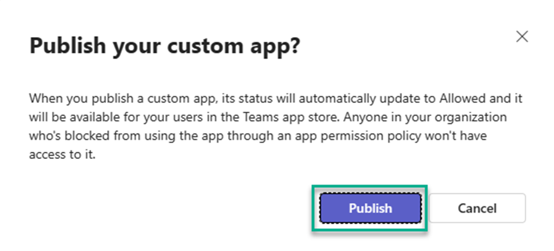

[Back to *Chat with your data* README](../README.md)

# Teams extension
[**USER STORY**](#user-story) | [**TEAMS DEPLOY**](#deployment-to-teams) | [**SUPPORTING DOCUMENTATION**](#supporting-documentation)
\
\

## User story
This extension enables users to experience Chat with your data within Teams, without having to switch platforms. It allows them to stay within their existing workflow and get the answers they need. Instead of building the Chat with your data solution accelerator from scratch within Teams, the same underlying backend used for the web application is leveraged within Teams.



## Deployment to Teams
**IMPORTANT**: Before you proceed, installation and configuration of the [Chat with your data with speech-to-text deployment](../README.md) is required.

### Pre-requisites
- [Visual Studio Code](https://code.visualstudio.com/)
    - Extensions
        - [Teams Toolkit](https://marketplace.visualstudio.com/items?itemName=TeamsDevApp.ms-teams-vscode-extension) (optional: Teams extension only)
- Install [Node.js](https://nodejs.org/en)
  - Install the LTS version (Recommended for Most Users)
- [Enable custom Teams apps and turn on custom app uploading](https://learn.microsoft.com/en-us/microsoftteams/platform/concepts/build-and-test/prepare-your-o365-tenant#enable-custom-teams-apps-and-turn-on-custom-app-uploading) (optional: Teams extension only)
- In order to publish the App to the Teams Store, the Teams Administrator role is required.

### Deploy Teams application
1. Clone this GitHub repo.
2. Open the “extensions/teams” folder with Visual Studio Code


3. Open the file env\\.env.test



4. Locate the environment variable _AZURE_FUNCTION_URL_.
5. Replace the `<RESOURCE_TOKEN>`  and `<FUNCTION_APP_CLIENT_KEY>` with the name of your Function App resource and its clientKey (created in previous section)
    ```env
    AZURE_FUNCTION_URL=https://backend-<RESOURCE_TOKEN>.azurewebsites.net/api/GetConversationResponse?code=<FUNCTION_APP_CLIENT_KEY>&clientId=clientKey

    ```
    
6. Save the file.
7. Select Teams Toolkit from the navigation panel.


8. Within the Teams Toolkit panel, login to the following accounts:

  **Sign in to Microsoft 365**: Use your Microsoft 365 work or school account with a valid E5 subscription for building your app. If you don't have a valid account, you can join [Microsoft 365 developer program](https://developer.microsoft.com/microsoft-365/dev-program) to get a free account before you start.

  **Sign in to Azure**: Use your Azure account for deploying your app on Azure. You can [create a free Azure account](https://azure.microsoft.com/free/) before you start.

> **WARNING**: When deploying the Azure Bot Service, if the Microsoft 365 is in a different tenant than your Azure resources, then the App Registration associated with your resultant Bot Service instance will not be in Azure, but in Entra in the M365 tenant! To access Entra in an M365 tenant, open another tab where you are authenticated to this tenant and enter https://portal.azure.com. This will allow you to choose *Microsoft Entra ID* from the top left menu. Your app registation can be amended there. This is where you will need to create a new secret if the old one expires.


9. Under **Environment**, select **test**.


10. Under **Lifecycle**, select **Provision**.



11. Within the command palette, select **test** for the environment.


12. Select the resource group created earlier in the installation


13. When prompted about Azure charges, select **Provision**.



14. Verify that the provisioning was successful.


15. Under **Lifecycle**, select **Deploy**.


16. Within the command palette, select **test** for the environment.


17. When prompted, select **Deploy**.


18. Verify that the Deployment was successful.


19. Under **Lifecycle**, select **Publish**.



20. Within the command palette, select **test** for the environment.


21. Verify that the Publish was successful.


22. Select **Go to admin portal**.


23. On the Manage apps page within the Teams Admin portal, you should see one submitted custom app pending approval.



24. In the search by name input box, enter: **enterprise chat**


25. Select the app and then select **Allow**.


26. Select the app name.


27. Select **Publish**.



28. When prompted, select **Publish**.



29. Depending on your environment, it may take several hours to publish.


### [Local deployment instructions](TEAMS_LOCAL_DEPLOYMENT.md)
To customize the accelerator or run it locally, first, copy the .env.sample file to your development environment's .env file, and edit it according to environment variable values table. Learn more about deploying locally [here](TEAMS_LOCAL_DEPLOYMENT.md).
\
\


## Supporting documentation
### Resource links for Teams extension
This solution accelerator deploys the following resources. It's crucial to comprehend the functionality of each. Below are the links to their respective documentation:
- [Bots in Microsoft Teams - Teams | Microsoft Learn](https://learn.microsoft.com/en-us/microsoftteams/platform/bots/what-are-bots)
